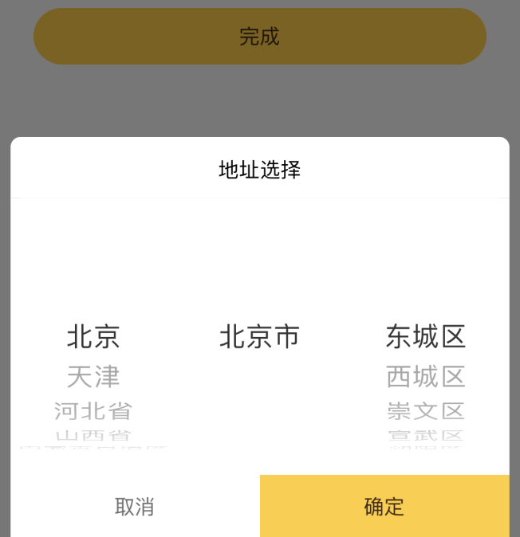
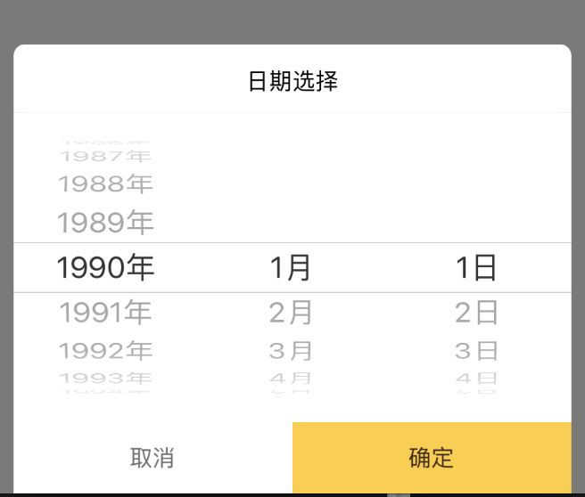

> 鉴于在大多数情况下picker/datePicker并不实用或者说使用起来bug多多
  因此可以采用popUp+pickerView来替代

  示例1:地址联动
  
  
  示例2:日期联动
  
  ```
    ···
    render() {
    return (
      <View style={style.popupWrap}>
        {this.renderHeader()}
        <PickerView
          onChange={this.onChange}
          value={this.state.value.length ? this.state.value : this.ids}
          data={this.state.data}
          format={(values) => { return values.join(',') }}
          cascade={false}
        />
        <ActivityIndicator
          toast
          animating={this.state.loading}
        />
        {this.renderBootom()}
      </View>
    )
  }
  ···
  ```